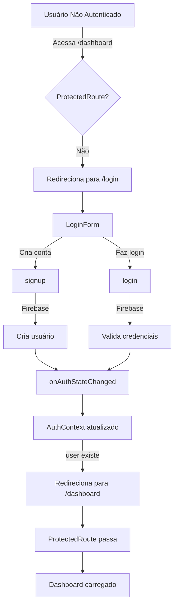

# 🔐 Sistema de Autenticação Firebase

## ✅ Status: Implementado

Todo o sistema agora usa **Firebase Authentication** como banco de dados de usuários. Todas as rotas do dashboard estão protegidas.

## 🏗️ Arquitetura

```
Usuário (não autenticado)
    ↓
  /login (página pública)
    ↓
Firebase Authentication
    ↓
Usuário (autenticado)
    ↓
AuthProvider (contexto global)
    ↓
ProtectedRoute (proteção de rotas)
    ↓
/dashboard/** (rotas privadas)
```

## 📁 Arquivos Criados/Atualizados

### Core de Autenticação
- **[src/lib/auth-context.tsx](../src/lib/auth-context.tsx)** - Contexto global de autenticação
- **[src/lib/protected-route.tsx](../src/lib/protected-route.tsx)** - Componente para proteger rotas
- **[src/lib/auth.ts](../src/lib/auth.ts)** - Funções de login/logout/signup
- **[src/components/LoginForm.tsx](../src/components/LoginForm.tsx)** - Formulário de login/signup

### Integrações
- **[src/app/layout.tsx](../src/app/layout.tsx)** - Adicionado AuthProvider
- **[src/app/dashboard/layout.tsx](../src/app/dashboard/layout.tsx)** - Adicionado ProtectedRoute
- **[src/middleware.ts](../src/middleware.ts)** - Atualizado para trabalhar com Firebase
- **[src/app/login/page.tsx](../src/app/login/page.tsx)** - Atualizado para usar LoginForm

## 🚀 Como Usar

### 1. Configurar Variáveis de Ambiente

Adicione ao `.env.local`:

```env
NEXT_PUBLIC_FIREBASE_API_KEY=sua_chave_aqui
NEXT_PUBLIC_FIREBASE_AUTH_DOMAIN=seu_projeto.firebaseapp.com
NEXT_PUBLIC_FIREBASE_PROJECT_ID=seu_projeto_id
NEXT_PUBLIC_FIREBASE_STORAGE_BUCKET=seu_projeto.appspot.com
NEXT_PUBLIC_FIREBASE_MESSAGING_SENDER_ID=seu_sender_id
NEXT_PUBLIC_FIREBASE_APP_ID=seu_app_id
```

### 2. Ativar Autenticação no Firebase Console

1. Vá para [Firebase Console](https://console.firebase.google.com/)
2. Selecione seu projeto
3. Em **Authentication** > **Sign-in method**
4. Ative **Email/Password**

### 3. Fluxo de Usuário

**Novo Usuário:**
1. Acessa `/login`
2. Clica em "Não tem conta?"
3. Preenche email e senha
4. Clica em "Criar Conta"
5. Firebase cria novo usuário
6. Redireciona para `/dashboard`

**Usuário Existente:**
1. Acessa `/login`
2. Preenche email e senha
3. Clica em "Entrar"
4. Firebase valida credenciais
5. Redireciona para `/dashboard`

**Fazer Logout:**
1. No dashboard, clica no ícone de logout (canto inferior da sidebar)
2. Redireciona para `/login`

## 🔒 Segurança

### Proteção de Rotas

Todas as rotas do dashboard (`/dashboard/**`) são protegidas pelo componente `ProtectedRoute`:

```typescript
// src/app/dashboard/layout.tsx
<ProtectedRoute>
  {/* Conteúdo do dashboard */}
</ProtectedRoute>
```

Se um usuário não autenticado tentar acessar `/dashboard`, será redirecionado para `/login`.

### Variáveis de Ambiente

- Variáveis com prefixo `NEXT_PUBLIC_` são públicas (visíveis no cliente)
- São seguras porque não contêm dados sensíveis (apenas chaves públicas)
- **Nunca** compartilhe a `FIREBASE_SECRET` em arquivos públicos (se precisar)

## 🎯 Contexto de Autenticação

Para acessar o usuário autenticado em qualquer componente:

```typescript
'use client'

import { useAuthContext } from '@/lib/auth-context'

export default function MeuComponente() {
  const { user, isAuthenticated, loading } = useAuthContext()

  if (loading) return <p>Carregando...</p>
  if (!isAuthenticated) return <p>Não autenticado</p>

  return <p>Bem-vindo, {user?.email}!</p>
}
```

## 📊 Fluxo de Autenticação



## 🐛 Tratamento de Erros

O `LoginForm` trata erros comuns do Firebase:

- `auth/user-not-found` → "Usuário não encontrado"
- `auth/wrong-password` → "Senha incorreta"
- `auth/email-already-in-use` → "Email já registrado"
- `auth/weak-password` → "Senha muito fraca"
- `auth/invalid-email` → "Email inválido"

## 📱 Responsividade

- ✅ Desktop (Login com two-panel layout)
- ✅ Tablet (Responsivo)
- ✅ Mobile (Layout single-column)

## 🔗 Próximas Etapas

1. ✅ Autenticação implementada
2. ⏳ Integrar com Firestore para dados do usuário
3. ⏳ Dashboard protegido
4. ⏳ Páginas internas protegidas
5. ⏳ Sistema de roles/permissões (admin, vendedor, etc.)

## 🆘 Troubleshooting

**Problema:** "Firebase configuration error"
- **Solução:** Verifique as variáveis de ambiente em `.env.local`

**Problema:** Usuários não conseguem fazer login
- **Solução:** Verifique se Autenticação está ativada no Firebase Console

**Problema:** Redireciona infinitamente para /login
- **Solução:** Verifique se o usuário existe no Firebase Authentication

---

**Status:** ✅ Sistema de autenticação Firebase totalmente implementado!
